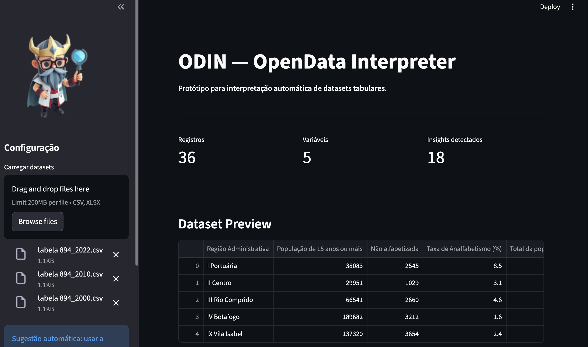
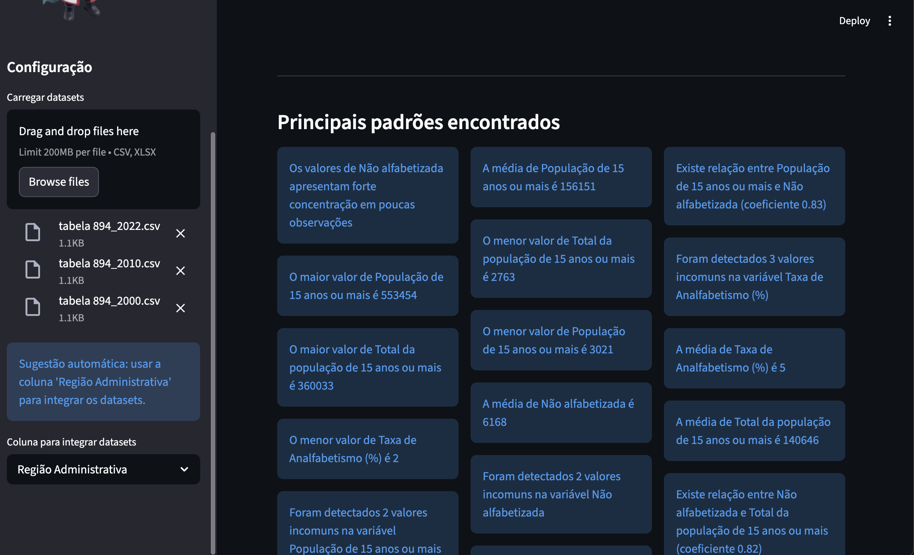
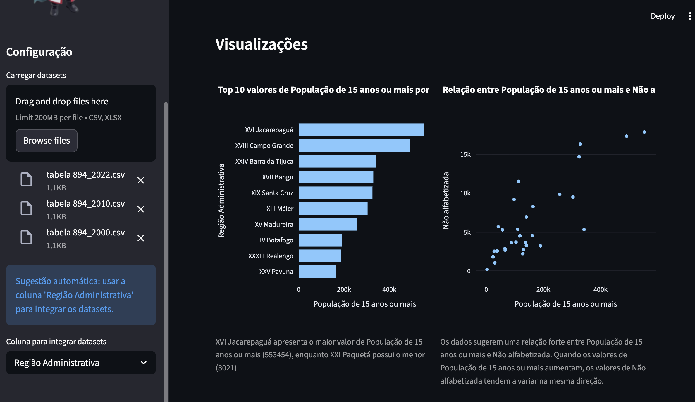
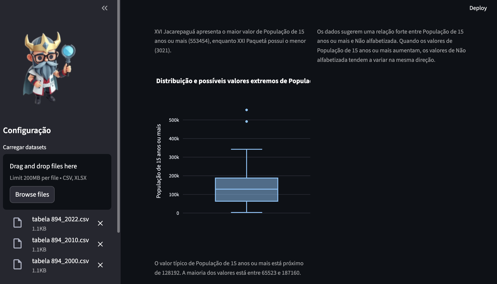

# ODIN — OpenData Interpreter

## Visão Geral

O **ODIN (OpenData Interpreter)** é uma ferramenta computacional desenvolvida para **interpretar automaticamente conjuntos de dados estruturados**, com foco especial em **dados abertos**. A ferramenta reduz barreiras técnicas associadas à análise de dados ao automatizar tarefas típicas da análise exploratória, como:

- identificação de padrões estatísticos
- geração automática de visualizações
- explicação de gráficos
- produção de interpretações em linguagem natural

A plataforma foi projetada para permitir que **usuários com diferentes níveis de conhecimento técnico — incluindo cidadãos sem formação em ciência de dados — possam compreender padrões, relações e tendências presentes em conjuntos de dados**.

Ao transformar dados em visualizações e explicações acessíveis, o ODIN contribui para tornar a análise de dados mais compreensível e inclusiva.

---

# Objetivos

Os principais objetivos do **ODIN** são:

- Facilitar a interpretação de dados abertos
- Detectar automaticamente padrões relevantes nos dados
- Gerar visualizações apropriadas para diferentes tipos de variáveis
- Explicar resultados em linguagem acessível
- Produzir uma narrativa geral sobre o conjunto de dados

Com isso, a ferramenta busca ampliar o acesso à análise de dados e contribuir para maior transparência e compreensão de informações públicas.

---

# Arquitetura do Sistema

O sistema utiliza uma arquitetura modular organizada como um **pipeline de interpretação de dados**.

Fluxo geral do sistema:

Datasets (CSV / XLSX)

↓

Carregamento de Dados

↓

Integração de Datasets

↓

Profiling de Variáveis

↓

Detecção de Padrões

↓

Geração de Visualizações

↓

Explicação das Visualizações

↓

Interpretação Geral com LLM

# Instalação

1. Clone o repositório

2. Instale as dependências

3. Instale o Ollama - https://ollama.com/download

4. Baixe o modelo utilizado pelo Odin - ``ollama pull mistral``

5. Inicie o servidor do Ollama - ``ollama serve``

6. Execute o app - ``streamlit run app.py``

# Interface

